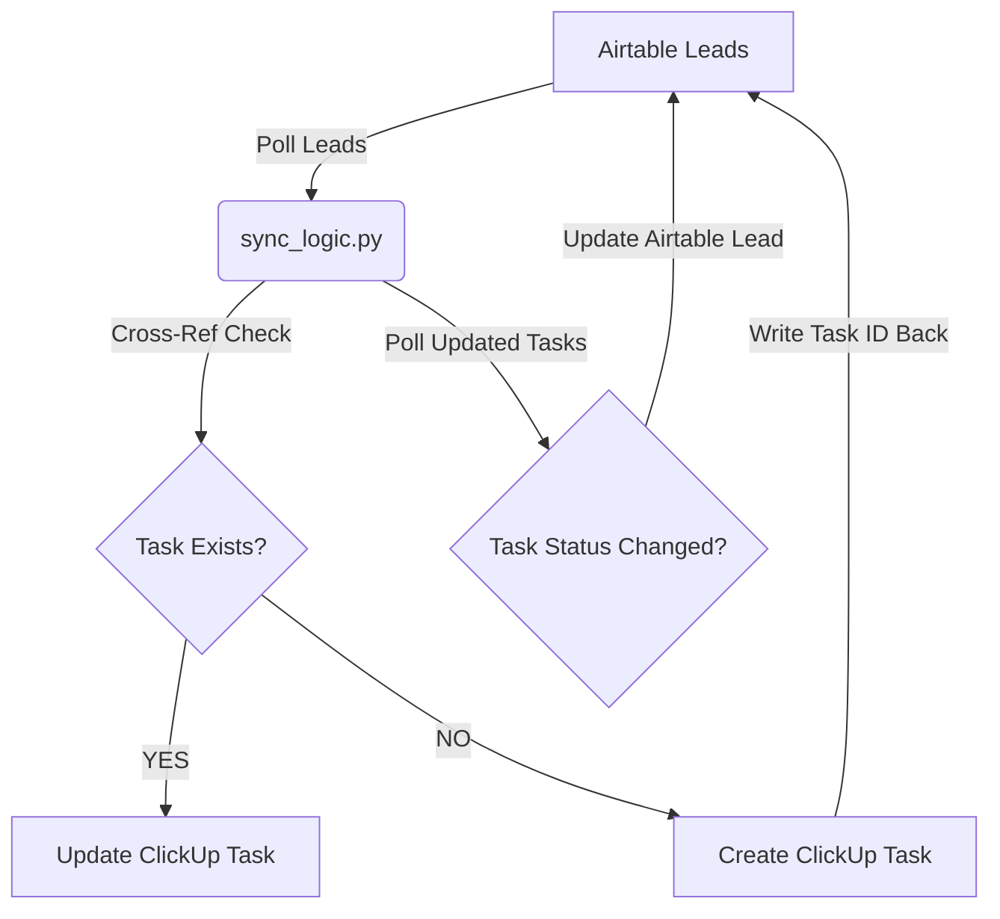

# 🚀 Two-Way Sync Automation: Airtable ↔ ClickUp

This project implements a clean, reliable, and idempotent two-way sync between **Airtable** (as a Lead Tracker) and **ClickUp** (as a Work Tracker).  
It ensures that whenever a lead changes in Airtable, the corresponding task in ClickUp updates — and whenever a task changes in ClickUp, the corresponding lead in Airtable updates.  
No duplicates. No mismatches. Just consistent data across both systems.

---

## 🧭 Overview

- **CRM Side:** Airtable (Leads)  
- **Task Side:** ClickUp (Tasks)  
- **Tech Stack:** Python 3.10+, REST APIs, modular clients, environment-based configuration  
- **Primary Goal:** Keep sales records and team tasks perfectly in sync  

This sync runs safely and repeatedly thanks to robust idempotency. Even if executed 100 times, it will not create duplicates or corrupt data.

---

## 🏗️ Status Mapping

Because the ClickUp List supports only *three* statuses, we mapped Airtable statuses in a predictable, consistent way:

| Airtable Status | ClickUp Status | Sync Direction | Description |
|-----------------|----------------|----------------|-------------|
| **NEW**         | To Do          | Lead → Task    | Fresh lead, work has not begun. |
| **CONTACTED**   | In Progress    | Lead ↔ Task    | Work in motion, follow-up ongoing. |
| **QUALIFIED**   | Complete       | Lead ↔ Task    | Lead successfully qualified. |
| **LOST**        | Complete       | Lead → Task    | Lead closed as lost. Task also marked complete. |

---

## 🔁 Sync Architecture

The sync executes in two major phases:

### **Phase 1 — Airtable → ClickUp**
1. Fetch leads from Airtable  
2. For each lead:
   - If Airtable already contains a ClickUp Task ID → **update** the ClickUp task  
   - If not → **create** a new ClickUp task  
3. Write back the ClickUp Task ID to Airtable on creation

### **Phase 2 — ClickUp → Airtable**
1. Fetch recently updated ClickUp tasks  
2. If a task’s status changed → update the mapped Airtable record status  

---

## 🔍 Visual Flow (Mermaid)



---

# ⚙️ Setup Instructions

## 1. Requirements
- Python 3.10+  
- Airtable API key  
- ClickUp personal API token  
- `.env` for configuration  

---

## 2. Installation

```bash
git clone https://github.com/HarshilKanadiya/automation-two-way-sync-harshil-kanadiya.git

cd automation-two-way-sync-harshil-kanadiya

pip install -r requirements.txt
```

---

## 3. Configure `.env`

```
# AIRTABLE CONFIG
AIRTABLE_API_KEY="<YOUR_AIRTABLE_KEY>"
AIRTABLE_BASE_ID="<YOUR_BASE_ID>"
AIRTABLE_TABLE_NAME="Leads"

# CLICKUP CONFIG
CLICKUP_API_KEY="<YOUR_CLICKUP_PERSONAL_API_TOKEN>"
CLICKUP_LIST_ID="<YOUR_CLICKUP_LIST_ID>"
CLICKUP_CUSTOM_FIELD_ID="<CLICKUP_CUSTOM_FIELD_FOR_AIRTABLE_ID>"
```

---

# ▶️ Running the Sync

From the project root:

```bash
python -m main
```

---

# 🧪 Quick Simulation 

### Airtable → ClickUp  
- Change Airtable lead from **NEW → CONTACTED**  
➡️ ClickUp task becomes **In Progress**

### ClickUp → Airtable  
- Mark a ClickUp task as **Complete**  
➡️ Airtable lead becomes **QUALIFIED**

---

# 🛡️ Idempotency & Error Handling

## ✔️ Idempotency

The system uses **stable cross-reference IDs**:

- Airtable stores the **ClickUp Task ID**  
- ClickUp stores the **Airtable Record ID** in a custom field  

This guarantees:

- If a ClickUp Task ID exists → **Update Only**  
- If missing → **Create Once**  
- Running the sync repeatedly → **No duplicates ever**  

---

## ⚠️ Error Handling

- All API calls wrapped in `try/except`  
- Client modules raise `ApiError`  
- Main script logs full context and continues  

Even if one record fails, the rest continue processing.

---

# 📝 Assumptions & Limitations

- Sync uses **polling**, not webhooks (Phase 2 is periodic)  
- Phase 1 ensures **strong consistency** with Airtable being the source of truth  
- ClickUp list constraint (only 3 statuses) required mapping LOST → Complete  

---

# 🤖 AI Usage Notes

AI (mainly Gemini) helped with:

- Early architecture sketches  
- Debugging API 400/401 errors  
- Refactoring modules  
- Cleaning noisy logs  
- Creating Readme.md


---

# 🎥 Walkthrough Video

👉 *https://drive.google.com/file/d/1cKlEMfMtPvA-wn2dpSYI7AYd1mSYOTna/view?usp=sharing*

---

# 🎉 Final Notes

This project removes the manual overhead of keeping CRM and task systems aligned.  
It’s reliable, predictable, and safe to run repeatedly without fear of duplicate tasks or data mismatch.
